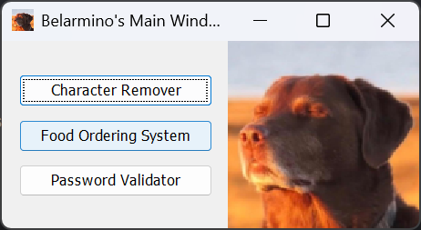
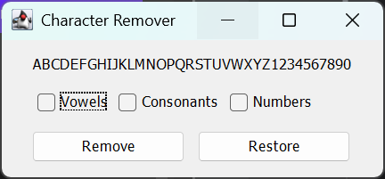
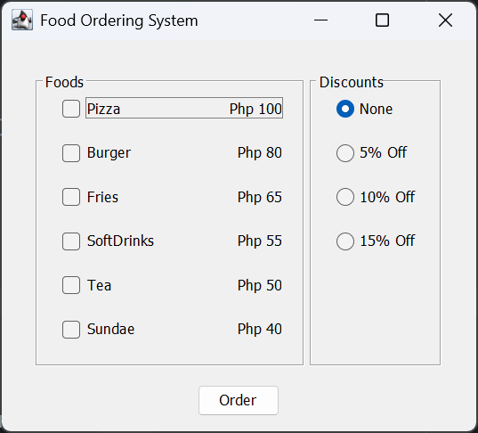
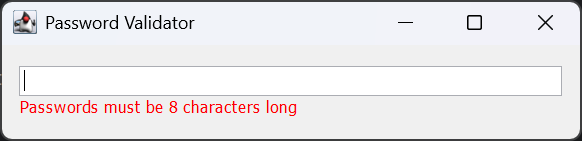

# Java Swing GUI

Java Swing GUI. Built using Java and OOPs.  
This README was prepared for the ease of use of my professor.  
This branch was developed and tested using **Amazon Corretto 23**

**Author:** Glenshayne Belarmino (Exception #3)– [@GlenshC](https://github.com/GlenshC)

---
## ✅ Recommended Usage

- These steps are **optional** but recommended, since each GUI window can also be run independently.
- Open the project in **IntelliJ IDEA**.
- Run `src/Main.java`.
- Use the main window to navigate and open the other GUI

## 📸 Preview

<!-- Replace with actual paths -->
| Description          | Image                                                  |
|----------------------|--------------------------------------------------------|
| Main UI              |                                  |
| Character Remover    |                        |
| Food Ordering System |                    |
| Pasword Validator    |  |
